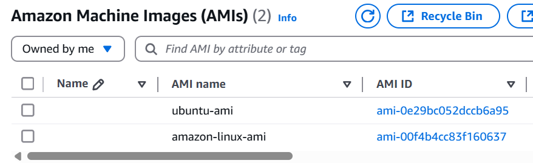
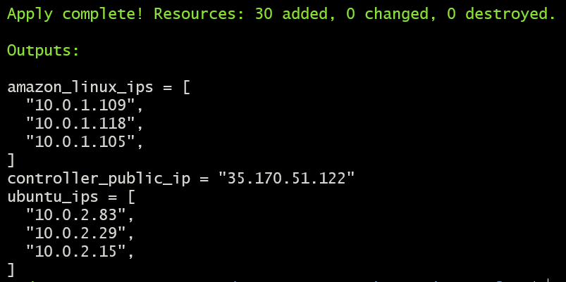
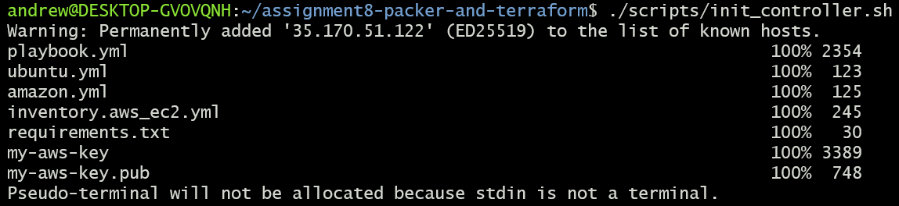
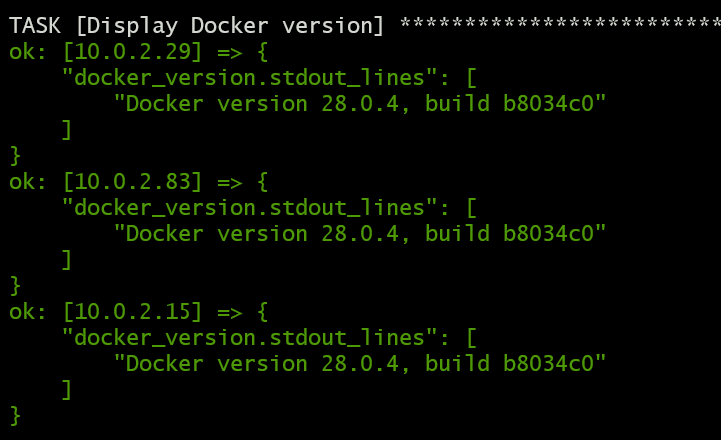
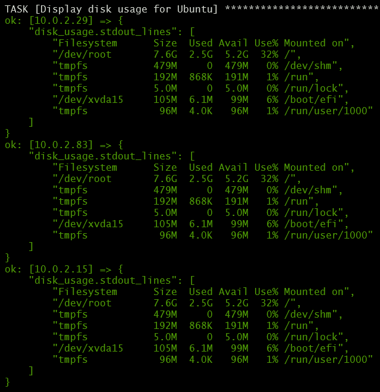
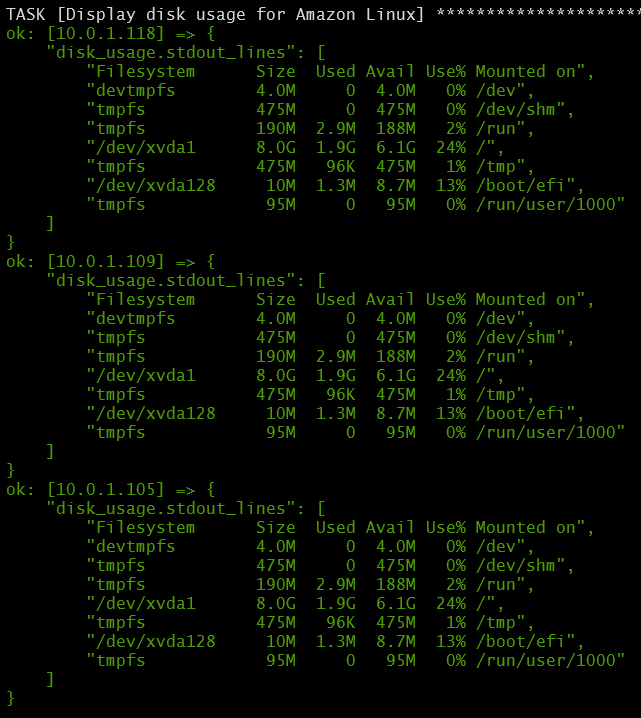
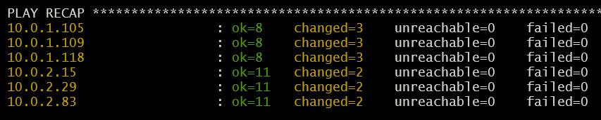

# AWS Infrastructure with Packer, Terraform, and Ansible

This repository contains files to create a custom AWS AMI with Packer, provision EC2 using Terraform, and configuration management using Ansible.   
The custom AMI is pre-installed with Docker, and preconfigured with your SSH public key for secure access. The Terraform configuration sets up an AWS environment with: VPC, public and private subnets, a bastion (as Ansible controller) in the public subnet, and 6 EC2 instances (as managed nodes) in the private subnet.

## Table of Contents
- [Prerequisites](#prerequisites)
- [Setup](#setup)
  - [AWS Credentials](#aws-credentials)
  - [SSH Key Pair](#ssh-key-pair)
- [Packer AMI Creation](#packer-ami-creation)
  - [Initialize and Validate](#initialize-and-validate)
  - [Build the AMI](#build-the-ami)
- [Terraform Infrastructure Provisioning](#terraform-infrastructure-provisioning)
  - [IP Setup for Bastion Host Access](#ip-setup-for-bastion-host-access)
  - [Initialize, Validate, and Apply](#initialize-validate-and-apply)
- [Testing and Verification](#testing-and-verification)
- [Troubleshooting](#troubleshooting)
- [Clean up](#clean-up)
- [Screenshots](#screenshots)

## Prerequisites
* #### Packer
    Install using the precompiled binaries and add to your `PATH`. For detailed instructions, please refer to the [official Packer documentation](https://developer.hashicorp.com/packer/tutorials/aws-get-started/get-started-install-cli)

* #### Terraform
    Install using the precompiled binaries and add to your `PATH`. Detailed instructions are available in the [official Terraform documentation](https://developer.hashicorp.com/terraform/tutorials/aws-get-started/install-cli).

* #### AWS account & credentials
    Ensure you have valid AWS credentials set up either via environment variables or an AWS credentials file.

* #### SSH Key Pair
    You need an SSH key pair (named `my-aws-key`) that Packer will use to embed your public key in the AMI for SSH access.

## Setup

### Git clone
Clone this repository locally (branch assignment10) and cd into it: 

```bash
git clone -b assignment10 git@github.com:aawihardja-usfca/assignment8-packer-and-terraform.git

cd assignment8-packer-and-terraform
```

### AWS credentials
Set your AWS credentials by updating the file named `credentials`. Replace each field with your credentials. <br> 

<i>Example credentials file content:</i>

```ini
[default]
aws_access_key_id=<your access key id>
aws_secret_access_key=<your secret access key>
aws_session_token=<your session token>
```

The Terraform files is already configured to look for your credentials in this file. Now we need to configure Packer to look for credentials in this manner, run the export command in your terminal:

```shell
export AWS_SHARED_CREDENTIALS_FILE=./credentials
```

### SSH key pair
Generate a key pair:
```bash
ssh-keygen -t rsa -b 4096 -f my-aws-key
```
Leave the passphrase empty. This command creates both <code>my-aws-key</code> and <code>my-aws-key.pub</code> in the current directory. Packer will copy <code>my-aws-key.pub</code> to add it to the list of authorized keys in the AMI.

## Packer AMI Creation

### Initialize and validate

1. #### Initialize the Packer configuration:
    ```bash
    packer init .
    ```

2. #### Validate the Packer file:
    ```bash
    packer validate .
    ```

### Build the AMI
Build your AMI using the following command:
```bash
packer build aws-ami.pkr.hcl
```
This may take about 6 mins. Packer will create 2 AMIs, using Ubuntu and another with Amazon Linux as the base image.
After a successful build, you should see output indicating the new AMI ID (e.g., <code>ami-0fb61569f4da07616</code>). You can verify this AMI in your AWS Console under <b>EC2 > Images > AMI</b>.

<i>Example output:</i>
```shell
==> learn-packer.amazon-ebs.amazon-linux: Creating AMI packer-ami from instance i-073fd58a56d483b1d
    learn-packer.amazon-ebs.amazon-linux: AMI: ami-0fb61569f4da07616
==> Builds finished.
```

## Terraform Infrastructure Provisioning
The Terraform files provision AWS resources including a VPC (with public and private subnets), a bastion host in the public subnet, and 6 EC2s in the private subnet using the created AMI.

### IP setup for Bastion Host access
Before provisioning, set your IP so that you can securely SSH into the bastion host. Make the `get_my_ip.sh` script executable:
```bash
chmod +x scripts/get_my_ip.sh
```

Terraform will execute this script to set the security groups.

### Initialize, validate, and apply

If you are in the project's root directory, use `-chdir`.

1. #### Initialize the Terraform configuration:
    ```bash
    terraform -chdir=terraform_config init
    ```

2. #### Validate the Terraform configuration

    ```bash
    terraform -chdir=terraform_config validate
    ```
    Look for a success message: <code><font color="green">Success!</font> The configuration is valid.</code>

3. #### Apply Terraform

    ```bash
    terraform -chdir=terraform_config apply
    ```
    Review the plan, then type yes when prompted. The apply process will provision the resources and output the following:

    - <b>controller_public_ip</b>: public IP of the controller.

    - <b>amazon_linux_ips</b>: private IPs for the instances with Amazon AMI.

    - <b>ubuntu_ips</b>: private IPs for the instances with Ubuntu AMI.

    <i>Example output</i>
    ```bash
    amazon_linux_ips = [
      "10.0.1.109",
      "10.0.1.118",
      "10.0.1.105",
    ]
    controller_public_ip = "35.170.51.122"
    ubuntu_ips = [
      "10.0.2.83",
      "10.0.2.29",
      "10.0.2.15",
    ]
    ```
    Note the controller and the managed nodes IP, as we will need it for testing later.

## Set up Ansible on the Controller

After Terraform finishes provisioning your resources, locate the controller’s public IP in the Terraform output. Open the `scripts/init_controller.sh` file, find the `CONTROLLER_IP` variable, and update it with the controller’s public IP, for example:

```shell
CONTROLLER_IP="35.170.51.122"
```

From the project's root directory, run:

```bash
chmod +x scripts/init_controller.sh
./scripts/init_controller.sh
```
This script performs the following steps:

1. Copies the `./ansible` directory to the controller, including playbooks and inventory files.

2. Transfers the public and private SSH keys to the controller, to enable it to communicate with managed nodes.

3. Copies your AWS credentials under the file `credentials` into the controller, so that you can run the playbook.

4. Installs the necessary tools on the controller, such as: `pip`, `ansible`, `boto`, and `botocore`.

After this script completes, your controller instance will be ready to manage the private nodes using Ansible playbook.

## Run Ansible Playbook from Controller
1. #### SSH into the Controller
    Replace `controller_ip` with the output from Terraform
    ```bash
    ssh -i my-aws-key ec2-user@<controller_ip>
    ```

2. #### Test running Ansible inventory
    From the user home directory, execute:
    ```bash
    ansible-inventory -i ansible/inventory.aws_ec2.yml --graph
    ```

    <i>Example output</i>
    
    ```shell
    @all:
      |--@ungrouped:
      |--@aws_ec2:
      |  |--10.0.1.118
      |  |--10.0.1.109
      |  |--10.0.1.105
      |  |--10.0.2.29
      |  |--10.0.2.83
      |  |--10.0.101.196
      |  |--10.0.2.15
      |--@amazon:
      |  |--10.0.1.118
      |  |--10.0.1.109
      |  |--10.0.1.105
      |--@ubuntu:
      |  |--10.0.2.29
      |  |--10.0.2.83
      |  |--10.0.2.15
    ```
      
2. #### Run the Ansible playbook
    From the user home directory execute:

    ```bash
    ansible-playbook -i ansible/inventory.aws_ec2.yml ansible/playbook.yml
    ```
    
    This will upgrade packages, Docker and report the disk usage of the managed EC2s.

    The output can be find under [Screenshots](#screenshots)

## Testing and Verification

1. #### SSH into the Controller:<br>
    Replace `controller_public_ip` with the output from Terraform:

    ```bash
    ssh -i my-aws-key ec2-user@<controller_public_ip>
    ```
    Accept the host key when prompted.

2. #### SSH from the Controller to an managed EC2 instance:
    Replace `user` with the correct user (ec2-user for Amazon or ubuntu for Ubuntu). Replace `<ec2_ip>` with one of the private IP addresses:
    ```bash
    ssh -i ~/.ssh/my-aws-key <user>@<ec2_ip>
    ```

3. #### Check if Docker is running on the managed instance:

    ```bash
    systemctl status docker
    ```
    
    You should get an output like:

    ```bash
    ● docker.service - Docker Application Container Engine
     Loaded: loaded (/lib/systemd/system/docker.service; enabled; vendor preset: enabled)
     Active: active (running) since Mon 2025-03-31 05:54:24 UTC; 25min ago
    ```

## Clean up
Close the SSH connection by pressing `Ctrl + D`. Go to the project's root directory and run:

```bash
terraform -chdir=terraform_config destroy
```

Type yes when prompted.  

You will need to deregister the AMIs and delete the Snapshots from the AWS web console manually.

## Troubleshooting
- #### Missing SSH Key Error:<br>
    If Packer cannot find <code>my-aws-key.pub</code>, ensure you have created the key pair as described in the SSH Key Pair section.

- #### Terraform Apply Failures:<br>
    Verify that your AWS credentials are correctly set up and that your VPC/subnet configurations meet AWS requirements.

## Screenshots
- #### Created AMIs
  

- #### Instance IPs from Terraform
  

- #### Executing scripts/init_controller.sh
  

- #### Inventory graph
  

- #### Ansible play: Docker version
  

- #### Ansible play: disk usage Ubuntu
  

- #### Ansible play: disk usage Amazon Linux
  

- #### Ansible playbook recap
  
